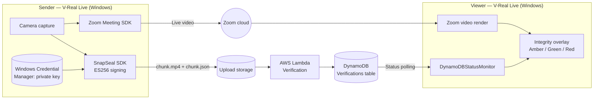

# SnapSeal — Video Conference Client (V-Real Live)

> Cryptographically signed live video for Zoom meetings, with real-time integrity attestation for every participant who is watching.

SnapSeal's video conference component is a Windows desktop client built on the **Zoom Meeting SDK**. It signs outgoing video **at the point of capture** ("first-mile signing"), uploads signed chunks to the SnapSeal verification service on AWS, and shows viewers a live integrity indicator so they can tell, during the call, whether the video they are seeing is authentic and unaltered.

This component is the proof of concept for the live video conferencing embodiment of SnapSeal, developed at **V-Real Labs**.

---

## Table of Contents

- [Why this exists](#why-this-exists)
- [How it works](#how-it-works)
- [The integrity indicator](#the-integrity-indicator)
- [Architecture](#architecture)
- [Tech stack](#tech-stack)
- [Prerequisites](#prerequisites)
- [Configuration](#configuration)
- [Building](#building)
- [Packaging and distribution](#packaging-and-distribution)
- [Running a session](#running-a-session)
- [Troubleshooting](#troubleshooting)
- [Known limitations](#known-limitations)
- [Roadmap](#roadmap)
- [Intellectual property](#intellectual-property)

---

## Why this exists

Real-time deepfakes make it increasingly hard to trust the face on the other side of a video call. Most content-provenance approaches (for example C2PA) allow signing *after* capture, which leaves a window where media can be altered before it is sealed.

SnapSeal closes that window. Video is signed inside the capture pipeline itself, before transmission or post-processing, so any later modification breaks the signature and is visible to viewers during the meeting.

---

## How it works

1. **Initialise** — On launch, the client initialises the SnapSeal SDK. Initialisation requires a provisioned private key; capture cannot start without one.
2. **Capture and sign** — Outgoing video is split into short chunks. Each chunk is hashed and signed with **ES256 (ECDSA P-256 / SHA-256)** before it leaves the capture pipeline.
3. **Upload** — Each chunk is uploaded as an indexed pair:
   - `chunk.mp4` — the video segment
   - `chunk.json` — the signature and metadata (index, timestamps, session ID)
4. **Verify** — An AWS Lambda function verifies each chunk's signature against the uploaded file pair and records the result in DynamoDB. The verification service works only on the uploaded file pairs; it never taps the live Zoom stream directly.
5. **Attest** — Viewers' clients poll the verification status for the session and update the on-screen integrity indicator.

### Cumulative verification

A stream is trusted only if **every** chunk so far has verified:

```
vs_vid = vs_chunk[0] AND vs_chunk[1] AND ... AND vs_chunk[n]
```

Once any chunk fails, the whole stream is permanently marked untrustworthy for the rest of the session.

---

## The integrity indicator

The client overlays a three-state indicator on the video window:

| State | Colour | Meaning |
|---|---|---|
| **Undetermined** | 🟡 Amber | Verification hasn't confirmed the stream yet. Covers startup latency and any loss of connectivity to the backend. Determined entirely on the client. |
| **Verified** | 🟢 Green | All chunks so far have passed signature verification. |
| **Failed** | 🔴 Red | At least one chunk failed verification. This state is permanent for the session. |

---

## Architecture



### Key internal modules

| Module | Responsibility |
|---|---|
| `SnapSeal SDK` | Key loading, chunk hashing, ES256 signing, DER-to-P1363 signature conversion |
| `AWSClientCache` | Creates and caches AWS clients and credentials once, at SDK start-up |
| `DynamoDBStatusMonitor` | Polls the `Verifications` table and drives the indicator state |
| Video overlay window | Renders the integrity indicator on top of the Zoom video |
| DUILib UI | PIN entry, join flow, and main application windows |

---

## Tech stack

- **Language:** C++
- **UI:** DUILib (XML-defined layouts)
- **Video conferencing:** Zoom Meeting SDK for Windows
- **Cryptography:** ECDSA P-256 (ES256), signatures converted from DER to IEEE P1363 format for verification
- **Cloud:** AWS Lambda, Amazon DynamoDB, AWS SDK for C++
- **Key storage:** Windows Credential Manager
- **Packaging:** MSIX, distributed privately through the Microsoft Store

---

## Prerequisites

- Windows 10 or 11 (x64)
- Visual Studio 2022 with the *Desktop development with C++* workload
- Zoom Meeting SDK for Windows (requires a Zoom Marketplace developer account and SDK app credentials)
- AWS SDK for C++ (DynamoDB component at minimum)
- An AWS account with the SnapSeal verification backend deployed
- A provisioned SnapSeal signing key for each sending device

---

## Configuration

### Zoom SDK credentials

<!-- TODO: describe where the SDK key/secret or JWT is configured, e.g. config file or build-time define -->

Configure your Zoom Meeting SDK app credentials in `TODO: path/to/config`.

### AWS

| Setting | Default |
|---|---|
| Region | `ap-southeast-2` |
| DynamoDB table | `Verifications` |

AWS credentials are stored in **Windows Credential Manager**, not in plain-text files. <!-- TODO: note the credential target name the app reads -->

### Signing key

The device's private signing key is stored in Windows Credential Manager and unlocked with the user's PIN on startup. <!-- TODO: add key provisioning steps -->

---

## Building

<!-- TODO: replace with the project's actual build steps -->

```powershell
git clone TODO:repo-url
cd TODO:repo-folder

# Open the solution in Visual Studio 2022 and build:
#   Configuration: Release
#   Platform:      x64
```

Make sure the Zoom SDK and AWS SDK include and library paths are set in the project properties before building.

---

## Packaging and distribution

The client is packaged as an **MSIX** and distributed privately through the **Microsoft Store**, so only approved tenants and users can install it.

<!-- TODO: add MSIX packaging project name, signing certificate details and Store submission steps -->

---

## Running a session

1. Launch **V-Real Live** and enter your PIN to unlock the signing key.
2. Choose **Start** or **Join Meeting** and enter the meeting details.
3. Once in the meeting, the integrity indicator appears on the video:
   - Amber while verification warms up (typically the first few seconds)
   - Green once the backend has confirmed the first chunks
   - Red if any chunk fails verification

---

## Troubleshooting

### Slow join (long gap between clicking Join and the meeting starting)

**Symptom:** The log shows:

```
[AWSClientCache] getDynamoDBClient: pre-init not started, returning nullptr
[DynamoDBStatusMonitor] Initializing own DynamoDB client ...
```

followed by a long pause before `Credentials found`.

**Cause:** `DynamoDBStatusMonitor` is building its own AWS client at join time and walking the full AWS credential provider chain.

**Fix:** Make sure `AWSClientCache` pre-initialisation runs right after the Zoom SDK initialises, and that credentials are loaded directly from Windows Credential Manager rather than through the default chain. With this in place, time from PIN entry to first frame drops from around 2.5 minutes to about 15 seconds.

### Indicator stuck on amber

The client can't reach the verification backend or hasn't received a result yet. Check network access to AWS, that the DynamoDB table and region are correct, and that the sender's chunks are being uploaded.

### Crash on PIN entry

DUILib `Notify` callbacks can re-enter while a window is being modified or closed. Avoid destroying or changing windows directly inside a `Notify` handler; post the action to run after the callback returns.

---

## Known limitations

- Windows only.
- Signs the **local** participant's outgoing stream only; signing every participant's stream is future work.
- Keys are held in software (Windows Credential Manager), not in hardware.
- Verification lags live video by a few seconds, which is why the amber state exists.

---

## Roadmap

- **Multi-participant signing:** sign and verify every participant's stream in a meeting.
- **Hardware and cloud key provisioning:** PKCS#11 tokens, smartphone secure enclaves, and cloud HSMs.
- Additional conferencing platforms beyond Zoom.

---

## Intellectual property

SnapSeal is the subject of a provisional patent application covering first-mile cryptographic signing, the three-state visual integrity indicator, and cumulative AND verification.

**Inventors:** Vinod Nair, Craig Dore
**© V-Real Labs.** All rights reserved. <!-- TODO: confirm licence -->

This project uses the Zoom Meeting SDK under Zoom's developer terms. Zoom is a trademark of Zoom Video Communications, Inc.; this project is not affiliated with or endorsed by Zoom.
